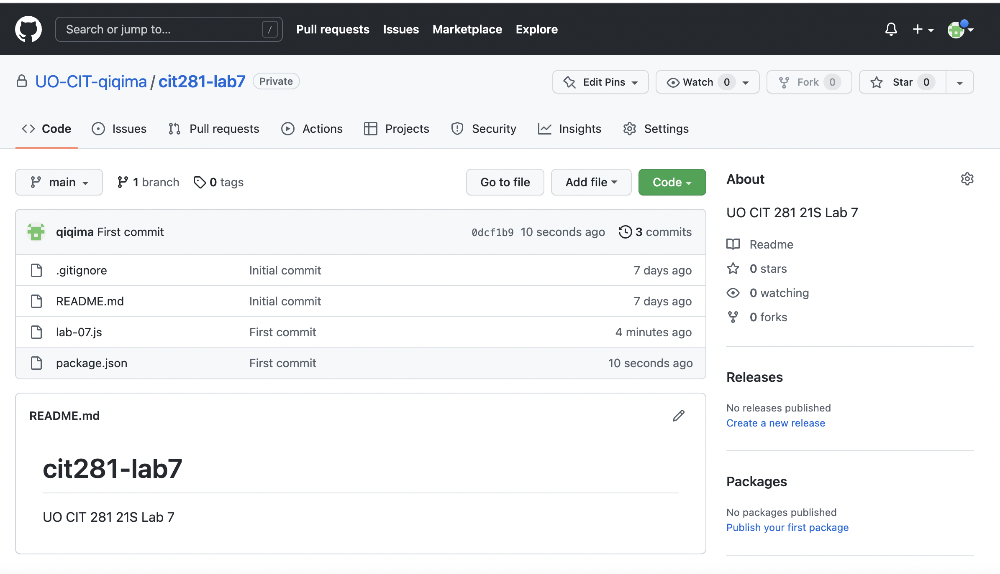

# cit281-lab-7
[cit281 lab-7](https://github.com/UO-CIT-qiqima/cit281-lab-7)

Lab 7:
1. Learn to create your own GitHub organization for the CIT Minor and Github repository.
2. Learn to clone your GitHub repository to your local system.
3. Practice use extends to inhreit.
4. Practice with error handling.
5. Practice use push to push changes to GitHub.

